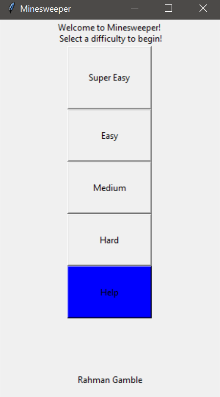
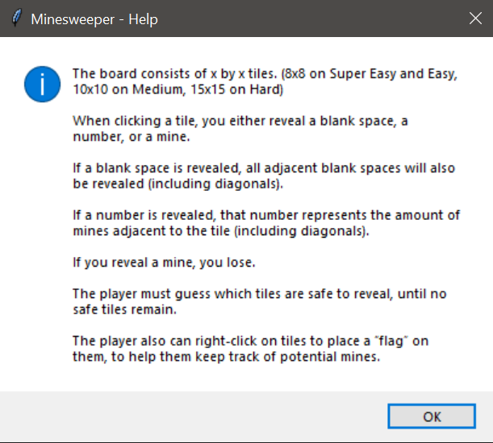
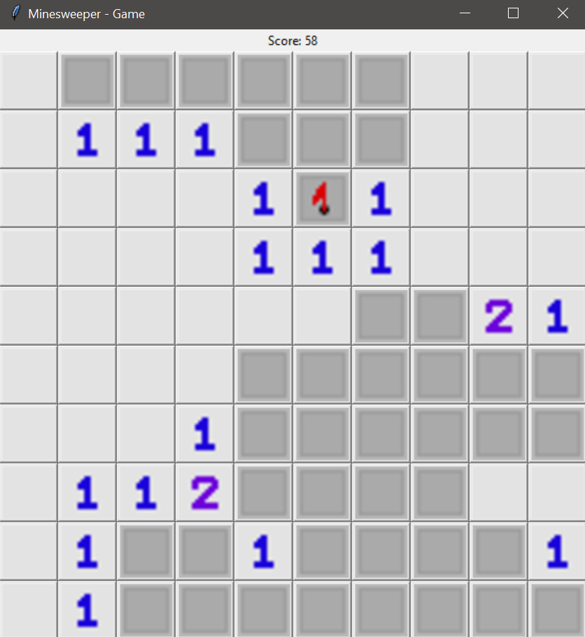

# Minesweeper with Python & Tkinter

This is a version of the logic puzzle game Minesweeper created using Python3.

## Main Menu
When you run the program, you will be greeted with the main menu. Click one of the buttons to begin the game, or press the blue help button for more information.

## Help Menu

Pressing the help button will open a window explaining the rules of the game.

## Board

The board will consist of the size chosen (8x8, 10x10, or 15x15). In order to play another difficulty, exit the window and launch the program again. Alternatively, achieve victory or defeat to receive the option to try again or quit.

### License
Apache 2.0, see [LICENSE.txt](/LICENSE.txt) file.